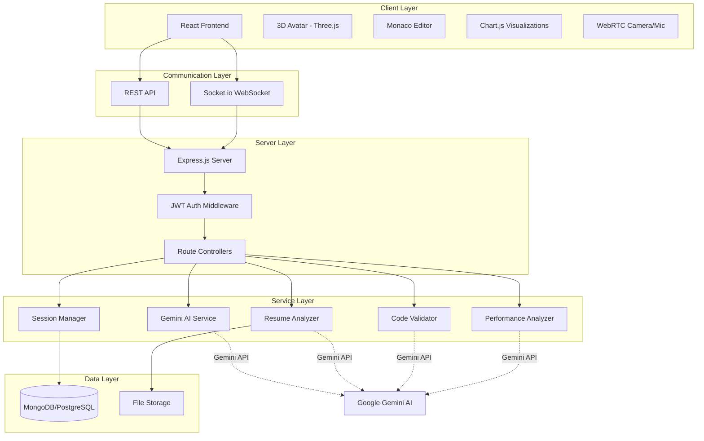

# Design Document

## Overview

The AI Interview Maker 2.0 enhancement transforms the existing basic interview simulator into a comprehensive AI-powered interview ecosystem. The design integrates Google Gemini AI for intelligent question generation, answer evaluation, and performance analysis while maintaining all existing features. The architecture follows a client-server model with React frontend, Node.js/Express backend, and Gemini AI as the intelligence layer.

### Key Design Principles

1. **Preserve Existing Features**: All current functionality (3D avatar, sentiment analysis, Socket.io, Chart.js) remains intact
2. **Modular Architecture**: Gemini AI integration is encapsulated in dedicated services for easy maintenance
3. **Progressive Enhancement**: New features build upon existing infrastructure without breaking changes
4. **Scalability**: Design supports multiple concurrent users with efficient resource management
5. **Security First**: JWT authentication, input validation, and secure data handling throughout

## Architecture

### High-Level Architecture



### Technology Stack Enhancement

**Frontend (React Migration)**
- React 18+ with React Router for SPA navigation
- React Three Fiber for 3D avatar (upgrade from vanilla Three.js)
- Monaco Editor React component for code challenges
- Axios for HTTP requests
- Socket.io-client for real-time communication
- Chart.js with react-chartjs-2 wrapper
- React Canvas Confetti for celebrations

**Backend (Enhanced Node.js)**
- Express.js 4.x with async/await patterns
- Socket.io 4.x for WebSocket communication
- JWT (jsonwebtoken) for authentication
- Multer for file upload handling
- Mongoose (MongoDB) or Sequelize (PostgreSQL) ORM
- @google/generative-ai SDK for Gemini integration
- bcrypt for password hashing
- express-validator for input validation

**AI Integration**
- Google Gemini 1.5 Pro model for complex reasoning
- Gemini 1.5 Flash for faster responses where appropriate
- Context caching for efficient token usage
- Streaming responses for real-time feedback

## Components and Interfaces

### 1. Authentication System

**Components:**
- `AuthController`: Handles registration, login, token refresh
- `AuthMiddleware`: Validates JWT tokens on protected routes
- `UserModel`: Database schema for user accounts

**Interface:**
```typescript
interface User {
  id: string;
  email: string;
  passwordHash: string;
  role: 'candidate' | 'admin';
  createdAt: Date;
  profile: {
    name: string;
    resumeUrl?: string;
    totalSessions: number;
    averageScore: number;
  };
}

interface AuthTokens {
  accessToken: string;
  refreshToken: string;
  expiresIn: number;
}
```

**API Endpoints:**
- `POST /auth/signup` - Register new user
- `POST /auth/login` - Authenticate and receive tokens
- `POST /auth/refresh` - Refresh access token
- `GET /auth/profile` - Get current user profile

### 2. Gemini AI Service

**Components:**
- `GeminiService`: Core service for Gemini API interactions
- `PromptBuilder`: Constructs optimized prompts for different use cases
- `ContextManager`: Maintains conversation history for follow-ups

**Interface:**
```typescript
interface GeminiService {
  generateQuestions(params: QuestionGenerationParams): Promise<Question[]>;
  evaluateAnswer(params: AnswerEvaluationParams): Promise<Evaluation>;
  analyzeResume(resumeText: string): Promise<ResumeAnalysis>;
  validateCode(params: CodeValidationParams): Promise<CodeFeedback>;
  generatePerformanceReport(session: InterviewSession): Promise<PerformanceReport>;
}

interface QuestionGenerationParams {
  role: string;
  resume?: string;
  jobDescription?: string;
  previousQuestions?: Question[];
  difficulty?: 'easy' | 'medium' | 'hard';
}

interface Question {
  id: string;
  text: string;
  category: 'technical' | 'behavioral' | 'situational' | 'coding';
  difficulty: string;
  expectedKeywords: string[];
  timeLimit: number;
}

interface AnswerEvaluationParams {
  question: Question;
  answer: string;
  conversationHistory: Message[];
}

interface Evaluation {
  score: number;
  feedback: string;
  strengths: string[];
  improvements: string[];
  followUpQuestion?: Question;
  sentiment: SentimentAnalysis;
}
```

**API Endpoints:**
- `POST /api/gemini/generate-questions` - Generate interview questions
- `POST /api/gemini/evaluate-answer` - Evaluate candidate answer
- `POST /api/gemini/analyze-resume` - Analyze uploaded resume
- `POST /api/gemini/validate-code` - Validate submitted code

### 3. Resume Analyzer

**Components:**
- `ResumeParser`: Extracts text from PDF/DOC files
- `ResumeAnalyzer`: Gemini-powered analysis service
- `FileUploadController`: Handles resume uploads

**Interface:**
```typescript
interface ResumeAnalysis {
  skills: string[];
  experience: ExperienceItem[];
  projects: ProjectItem[];
  education: EducationItem[];
  suggestions: string[];
  jdMatchScore?: number;
  strengthAreas: string[];
  improvementAreas: string[];
}

interface ExperienceItem {
  company: string;
  role: string;
  duration: string;
  highlights: string[];
}
```

**API Endpoints:**
- `POST /api/resume/upload` - Upload resume file
- `POST /api/resume/analyze` - Analyze resume with optional JD
- `GET /api/resume/:userId` - Retrieve user's resume analysis

### 4. Interview Session Manager

**Components:**
- `SessionController`: Manages interview lifecycle
- `SessionModel`: Database schema for sessions
- `RecordingService`: Handles video/audio recording

**Interface:**
```typescript
interface InterviewSession {
  id: string;
  userId: string;
  jobRole: string;
  mode: 'resume-based' | 'jd-based' | 'general';
  status: 'in-progress' | 'completed' | 'abandoned';
  startTime: Date;
  endTime?: Date;
  questions: SessionQuestion[];
  performanceReport?: PerformanceReport;
  recordingUrl?: string;
  transcriptUrl?: string;
}

interface SessionQuestion {
  question: Question;
  answer: string;
  evaluation: Evaluation;
  timeSpent: number;
  timestamp: Date;
}

interface PerformanceReport {
  overallScore: number;
  categoryScores: {
    technical: number;
    behavioral: number;
    communication: number;
  };
  wordCountMetrics: {
    average: number;
    total: number;
    perQuestion: number[];
  };
  sentimentAnalysis: {
    overall: string;
    confidence: number;
    clarity: number;
    professionalism: number;
  };
  strengths: string[];
  weaknesses: string[];
  recommendations: string[];
  carFrameworkScore?: number;
}
```

**API Endpoints:**
- `POST /api/sessions/start` - Start new interview session
- `POST /api/sessions/:id/submit-answer` - Submit answer for evaluation
- `POST /api/sessions/:id/complete` - Complete session and generate report
- `GET /api/sessions/:id` - Retrieve session details
- `GET /api/sessions/user/:userId` - Get user's session history

### 5. Coding Challenge System

**Components:**
- `CodingChallengeController`: Manages coding assessments
- `CodeExecutor`: Safely executes submitted code (sandboxed)
- `ChallengeBank`: Repository of role-specific challenges

**Interface:**
```typescript
interface CodingChallenge {
  id: string;
  title: string;
  description: string;
  difficulty: string;
  role: string;
  language: string[];
  testCases: TestCase[];
  starterCode: Record<string, string>;
}

interface TestCase {
  input: any;
  expectedOutput: any;
  isHidden: boolean;
}

interface CodeSubmission {
  challengeId: string;
  code: string;
  language: string;
}

interface CodeFeedback {
  isCorrect: boolean;
  testResults: TestResult[];
  geminiAnalysis: {
    codeQuality: number;
    efficiency: string;
    bestPractices: string[];
    suggestions: string[];
  };
  followUpQuestions: Question[];
}
```

**API Endpoints:**
- `GET /api/coding/challenges/:role` - Get challenges for role
- `POST /api/coding/submit` - Submit code for validation
- `POST /api/coding/execute` - Execute code with test cases

### 6. Real-Time Communication (Socket.io)

**Events:**
```typescript
// Client -> Server
interface ClientEvents {
  'session:start': (sessionId: string) => void;
  'answer:submit': (data: { sessionId: string; answer: string }) => void;
  'session:end': (sessionId: string) => void;
}

// Server -> Client
interface ServerEvents {
  'question:new': (question: Question) => void;
  'evaluation:result': (evaluation: Evaluation) => void;
  'score:update': (score: number) => void;
  'session:completed': (report: PerformanceReport) => void;
  'notification': (message: string) => void;
}
```

### 7. Admin Dashboard

**Components:**
- `AdminController`: Admin-specific operations
- `AnalyticsService`: Aggregates platform statistics
- `UserManagementService`: User CRUD operations

**Interface:**
```typescript
interface AdminDashboard {
  totalUsers: number;
  activeSessions: number;
  completedSessions: number;
  averagePlatformScore: number;
  roleDistribution: Record<string, number>;
  recentSessions: InterviewSession[];
}
```

**API Endpoints:**
- `GET /api/admin/dashboard` - Get dashboard statistics
- `GET /api/admin/users` - List all users with filters
- `GET /api/admin/sessions` - List all sessions with filters
- `POST /api/admin/export` - Export session data

### 8. Frontend Components (React)

**Component Hierarchy:**
```
App
├── AuthProvider
├── Router
│   ├── LoginPage
│   ├── SignupPage
│   ├── DashboardPage
│   │   ├── SessionHistory
│   │   ├── PerformanceStats
│   │   └── Leaderboard
│   ├── InterviewSetupPage
│   │   ├── RoleSelector
│   │   ├── ResumeUploader
│   │   └── JDInput
│   ├── InterviewPage
│   │   ├── Avatar3D
│   │   ├── QuestionDisplay
│   │   ├── AnswerInput
│   │   ├── VoiceRecorder
│   │   ├── CodeEditor (conditional)
│   │   ├── Timer
│   │   ├── ProgressBar
│   │   └── MentorModeToggle
│   ├── ResultsPage
│   │   ├── PerformanceChart
│   │   ├── FeedbackSummary
│   │   ├── SessionRecording
│   │   └── ConfettiCelebration
│   └── AdminPage
│       ├── UserManagement
│       ├── SessionAnalytics
│       └── SystemReports
```

## Data Models

### Database Schema (MongoDB Example)

```javascript
// User Schema
const UserSchema = new Schema({
  email: { type: String, required: true, unique: true },
  passwordHash: { type: String, required: true },
  role: { type: String, enum: ['candidate', 'admin'], default: 'candidate' },
  profile: {
    name: String,
    resumeUrl: String,
    resumeAnalysis: Object,
    totalSessions: { type: Number, default: 0 },
    averageScore: { type: Number, default: 0 }
  },
  createdAt: { type: Date, default: Date.now }
});

// Session Schema
const SessionSchema = new Schema({
  userId: { type: Schema.Types.ObjectId, ref: 'User', required: true },
  jobRole: { type: String, required: true },
  mode: { type: String, enum: ['resume-based', 'jd-based', 'general'] },
  status: { type: String, enum: ['in-progress', 'completed', 'abandoned'] },
  startTime: { type: Date, default: Date.now },
  endTime: Date,
  questions: [{
    question: Object,
    answer: String,
    evaluation: Object,
    timeSpent: Number,
    timestamp: Date
  }],
  performanceReport: Object,
  recordingUrl: String,
  transcriptUrl: String,
  metadata: {
    mentorModeEnabled: Boolean,
    jobDescription: String
  }
});

// Leaderboard Schema
const LeaderboardSchema = new Schema({
  userId: { type: Schema.Types.ObjectId, ref: 'User' },
  username: String,
  jobRole: String,
  averageScore: Number,
  totalSessions: Number,
  rank: Number,
  updatedAt: { type: Date, default: Date.now }
});
```

## Error Handling

### Error Categories

1. **Authentication Errors**
   - Invalid credentials
   - Expired tokens
   - Insufficient permissions

2. **Validation Errors**
   - Invalid input format
   - Missing required fields
   - File size/type violations

3. **Gemini API Errors**
   - Rate limiting
   - API quota exceeded
   - Network timeouts
   - Invalid responses

4. **Database Errors**
   - Connection failures
   - Query timeouts
   - Constraint violations

5. **File Processing Errors**
   - Unsupported file format
   - Corrupted files
   - Storage failures

### Error Handling Strategy

```typescript
class AppError extends Error {
  constructor(
    public statusCode: number,
    public message: string,
    public isOperational: boolean = true
  ) {
    super(message);
  }
}

// Global error handler middleware
const errorHandler = (err: Error, req: Request, res: Response, next: NextFunction) => {
  if (err instanceof AppError) {
    return res.status(err.statusCode).json({
      status: 'error',
      message: err.message
    });
  }
  
  // Log unexpected errors
  console.error('Unexpected error:', err);
  
  return res.status(500).json({
    status: 'error',
    message: 'Internal server error'
  });
};

// Gemini API error handling with retry logic
const callGeminiWithRetry = async (
  operation: () => Promise<any>,
  maxRetries: number = 3
): Promise<any> => {
  for (let attempt = 1; attempt <= maxRetries; attempt++) {
    try {
      return await operation();
    } catch (error) {
      if (attempt === maxRetries) throw error;
      
      // Exponential backoff
      await new Promise(resolve => setTimeout(resolve, 1000 * Math.pow(2, attempt)));
    }
  }
};
```

## Testing Strategy

### Unit Testing

**Backend Services:**
- `GeminiService`: Mock Gemini API responses
- `ResumeAnalyzer`: Test with sample resume files
- `AuthController`: Test JWT generation and validation
- `SessionManager`: Test session lifecycle operations

**Frontend Components:**
- `Avatar3D`: Test rendering and animations
- `CodeEditor`: Test syntax highlighting and validation
- `PerformanceChart`: Test data visualization
- `VoiceRecorder`: Mock Web Speech API

**Testing Tools:**
- Jest for unit tests
- React Testing Library for component tests
- Supertest for API endpoint tests
- Mock Service Worker for API mocking

### Integration Testing

**Test Scenarios:**
1. Complete interview flow (setup → questions → answers → report)
2. Resume upload and analysis pipeline
3. Real-time Socket.io communication
4. Authentication and authorization flow
5. Coding challenge submission and validation
6. Admin dashboard data aggregation

### End-to-End Testing

**Test Cases:**
1. User registration → login → complete interview → view results
2. Resume-based interview with follow-up questions
3. JD-based interview with coding challenge
4. Mentor mode enabled interview
5. Admin viewing and exporting session data

**Testing Tools:**
- Cypress or Playwright for E2E tests
- Test against staging environment with real Gemini API

### Performance Testing

**Metrics to Monitor:**
- API response times (target: < 2s for Gemini calls)
- WebSocket latency (target: < 100ms)
- Database query performance
- Concurrent user handling (target: 100+ simultaneous sessions)
- Memory usage and leak detection

**Tools:**
- Artillery or k6 for load testing
- Chrome DevTools for frontend performance
- New Relic or DataDog for production monitoring

## Security Considerations

### Authentication & Authorization

1. **Password Security**
   - bcrypt with salt rounds ≥ 10
   - Password strength requirements (min 8 chars, mixed case, numbers)
   - Rate limiting on login attempts

2. **JWT Security**
   - Short-lived access tokens (15 minutes)
   - Refresh tokens with rotation
   - Secure HTTP-only cookies for token storage
   - Token blacklisting for logout

3. **Role-Based Access Control**
   - Middleware to verify user roles
   - Separate admin routes with additional validation
   - Principle of least privilege

### Input Validation

1. **Server-Side Validation**
   - express-validator for all inputs
   - Sanitize user-provided text
   - File upload restrictions (type, size, content)

2. **Gemini Prompt Injection Prevention**
   - Input sanitization before sending to Gemini
   - Prompt templates with parameterized inputs
   - Output validation and filtering

### Data Protection

1. **Sensitive Data**
   - Encrypt resume files at rest
   - Secure video recording storage
   - GDPR compliance for user data

2. **API Security**
   - Gemini API key in environment variables
   - Rate limiting on all endpoints
   - CORS configuration for allowed origins

3. **Database Security**
   - Connection string in environment variables
   - Parameterized queries to prevent injection
   - Regular backups and encryption at rest

## Deployment Architecture

### Environment Configuration

```
Development:
- Local MongoDB/PostgreSQL
- Gemini API test key
- Hot reload enabled

Staging:
- Cloud database (MongoDB Atlas / AWS RDS)
- Gemini API production key with limits
- SSL/TLS enabled

Production:
- Replicated database cluster
- Gemini API production key
- CDN for static assets
- Load balancer for horizontal scaling
- SSL/TLS enforced
```

### Infrastructure

**Hosting Options:**
1. **Vercel** (Current) - Frontend + Serverless functions
2. **AWS** - EC2 for backend, S3 for file storage, CloudFront CDN
3. **Google Cloud** - App Engine, Cloud Storage, Cloud SQL
4. **Docker** - Containerized deployment for any platform

**Recommended Production Setup:**
```
Frontend: Vercel or Netlify
Backend: AWS EC2 or Google Cloud Run
Database: MongoDB Atlas or AWS RDS PostgreSQL
File Storage: AWS S3 or Google Cloud Storage
CDN: CloudFront or Cloudflare
Monitoring: DataDog or New Relic
```

## Migration Strategy

### Phase 1: Backend Enhancement (Week 1-2)

1. Set up new project structure with TypeScript
2. Implement authentication system with JWT
3. Integrate Gemini AI service
4. Create database models and migrations
5. Implement core API endpoints
6. Preserve existing `/saveSession` and `/sessions` endpoints

### Phase 2: Frontend Migration (Week 3-4)

1. Create React app with Create React App or Vite
2. Migrate existing HTML/CSS/JS to React components
3. Upgrade Three.js to React Three Fiber
4. Integrate Monaco Editor
5. Implement new UI for resume upload and JD input
6. Add authentication pages

### Phase 3: Feature Integration (Week 5-6)

1. Connect frontend to new backend APIs
2. Implement real-time Socket.io features
3. Add coding challenge system
4. Build performance report generation
5. Create admin dashboard
6. Implement session recording

### Phase 4: Testing & Polish (Week 7-8)

1. Write unit and integration tests
2. Conduct E2E testing
3. Performance optimization
4. Security audit
5. User acceptance testing
6. Documentation

### Backward Compatibility

- Maintain existing API endpoints during migration
- Gradual feature rollout with feature flags
- Database migration scripts for existing data
- Fallback to basic mode if Gemini API unavailable

## Performance Optimization

### Frontend Optimization

1. **Code Splitting**
   - Lazy load Monaco Editor
   - Route-based code splitting
   - Dynamic imports for heavy components

2. **Asset Optimization**
   - Compress images and videos
   - Use WebP format for images
   - Minify and bundle JavaScript/CSS

3. **Caching Strategy**
   - Service Worker for offline support
   - Cache API responses with appropriate TTL
   - LocalStorage for user preferences

### Backend Optimization

1. **Gemini API Optimization**
   - Context caching for repeated prompts
   - Batch requests where possible
   - Use Gemini Flash for simpler tasks

2. **Database Optimization**
   - Index frequently queried fields
   - Connection pooling
   - Query result caching with Redis

3. **API Response Optimization**
   - Compression middleware (gzip)
   - Pagination for list endpoints
   - Field selection to reduce payload size

## Monitoring & Analytics

### Application Metrics

- API endpoint response times
- Gemini API usage and costs
- Database query performance
- WebSocket connection stability
- Error rates and types

### Business Metrics

- User registration and retention
- Interview completion rates
- Average session duration
- Most popular job roles
- User satisfaction scores

### Logging Strategy

```typescript
// Structured logging with Winston
const logger = winston.createLogger({
  level: 'info',
  format: winston.format.json(),
  transports: [
    new winston.transports.File({ filename: 'error.log', level: 'error' }),
    new winston.transports.File({ filename: 'combined.log' })
  ]
});

// Log important events
logger.info('Session started', { userId, sessionId, jobRole });
logger.error('Gemini API error', { error, userId, attempt });
```

## Future Enhancements

1. **Multi-language Support** - Internationalization for global users
2. **Mobile App** - React Native version for iOS/Android
3. **Video Interview Analysis** - Analyze facial expressions and body language
4. **Interview Scheduling** - Calendar integration for practice sessions
5. **Peer Review** - Allow users to review each other's sessions
6. **Custom Question Banks** - Let companies create custom interview sets
7. **Integration APIs** - Allow third-party platforms to integrate
8. **AI Interview Coach** - Personalized long-term improvement tracking
